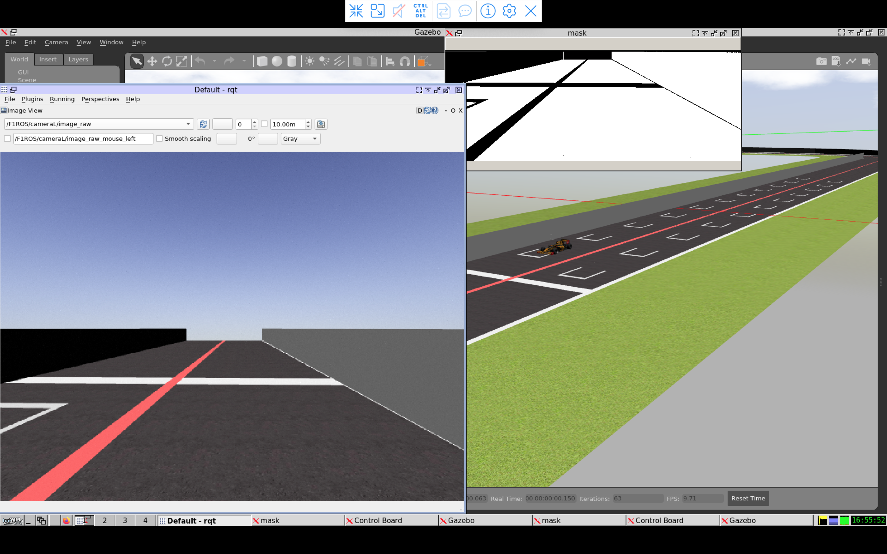

# Reinforcement Learning Studio (RL-Studio)

<div align="center">

## [](https://forthebadge.com) [](https://forthebadge.com)

## [ ](https://github.com/TezRomacH/python-package-template/pulls?utf8=%E2%9C%93&q=is%3Apr%20author%3Aapp%2Fdependabot)[ ](https://github.com/psf/black) [](https://github.com/TezRomacH/python-package-template/blob/master/.pre-commit-config.yaml) [](https://github.com/JdeRobot/RL-Studio/blob/main/LICENSE)

     

</div>

Reinforcement Learning Studio, RL-Studio, is a platform for developing robotic applications with reinforcement learning algorithms. Its modular design allows to work easily with different agents and algoritmhs in autonomous tasks and any simulator.

# Introduction

RL-Studio is designed to work with robots, as autonomous vehicles, in any relevant tasks with any simulators that provide adequate realism to transfer development to real environments automatically and with robustness --sim2real transfer.
The designed agents can support any type of sensor that collects information from the environment and, with reinforcement learning algorithms, can send correct signals to the actuators to adequately command the robot, following the standard reinforcement learning cycle.

## Working Modes

Rl-Studio allows you to work with different modes of operation, all of them neccesary to build a RL app:

- Training: the objective of any development in RL-Studio is to design a training that generates a suitable model for the environment in question. see diagram
- Retraining of models already generated, so that they continue learning in the same or different environments.
- Inference: Trained models are tested --inference -- in different environments in order to validate their learning.

## Agents

RL-Studio is designed to work with any robotic agent, mainly in autonomous driving through complex environments. However, thanks to the modularity of the application, it is easy to create new agents that are tested in other tasks, such as manipulation, legged robots, drones and so on.

## Algorithms

Qlearn, DQN, DDPG and PPO have currently been implemented to work on the different tasks developed. However, it is easy to design any other algorithms.

## Deep Learning frameworks

[Tensorflow](https://www.tensorflow.org/) 2.9.11 and [Pytorch](https://pytorch.org/) 1.13 are currently supported, although it is very easy to extend to others.

## Simulators and ROS

RL-Studio supports [ROS](http://wiki.ros.org/) Noetic which is necesary to interact with [Gazebo](https://classic.gazebosim.org/) or also as a bridge with [Carla](https://carla.readthedocs.io/en/0.9.13/). Although Carla can work without ROS also. Currently there are working canonical reinforcement lerning tasks with OpenAI simulator through [gymnasium](https://gymnasium.farama.org/) library.

# Installation

## Install ROS

RL-Studio works with ROS Noetic. You can [install ROS Noetic from the official documentation](http://wiki.ros.org/noetic/Installation/Ubuntu) and installing ROS Noetic Full Desktop.

### Clone the RL-studio repository

```bash
git clone git@github.com:JdeRobot/RL-Studio.git
```

or

```bash
git clone https://github.com/JdeRobot/RL-Studio.git
```


## Install dependencies using pip:

_It is highly recommended to create a virtual environment:_

```bash
cd RL-Studio
pip install -r requirements.txt
```

Add the project to `PYTHONPATH`:

```bash
echo "export PYTHONPATH=$PYTHONPATH:~/PATH/TO/RL-Studio" >> ~/.bashrc
source ~/.bashrc
```

The commits follow the [gitmoji](https://gitmoji.dev/) convention and the code is formatted with [Black](https://black.readthedocs.io/en/stable/).


## Checking everything. Set environment

### Set ROS Noetic and Formula 1 agent configuration

The fastest way to verify that the installation has been successful is to follow the next steps.

To connect RL-Studio with ROS and Gazebo and the different agents and circuits installed:

```bash
cd ~/PATH/TO/RL-Studio/rl_studio/installation
bash setup_noetic.bash
```

> :warning: if bash file execution gives an error, in some configurations can be fixed by editing the bash file and changing the line

```bash
catkin_make
```

by

```bash
catkin_make -DPYTHON_EXECUTABLE=/usr/bin/python3 -DPYTHON_INCLUDE_DIR=/usr/include<python3.8>
```

where python3.8 is the actual Python version in your virtual env.

The installation downloads the CustomRobots repository into the above directory, as follows:

```bash
CustomRobots/
envs/
installation/
wrappers/
```

The following routes will be added to the `.bashrc` file:

```bash
cd ~/PATH/TO/RL-Studio/rl_studio/CustomRobots/f1/worlds
export GAZEBO_RESOURCE_PATH=$PWD
```

The final variables to be stored are:

```bash
. . .
source /opt/ros/noetic/setup.bash
# Gazebo models
source $HOME/PATH/TO/RL-Studio/rl_studio/installation/catkin_ws/devel/setup.bash
export GAZEBO_MODEL_PATH=$GAZEBO_MODEL_PATH:$HOME/PATH/TO/RL-Studio/rl_studio/installation/catkin_ws/../../CustomRobots/f1/models
export GAZEBO_RESOURCE_PATH=$GAZEBO_RESOURCE_PATH:$HOME/PATH/TO/RL-Studio/rl_studio/CustomRobots/f1/worlds
. . .
```

To set Formula 1 environment run the following script (the same folder that before):

```bash
cd ~/PATH/TO/RL-Studio/rl_studio/installation
./formula1_setup.bash
```

The following routes will be added to the `.bashrc` file:

```bash
. . .
export GYM_GAZEBO_WORLD_CIRCUIT_F1=$HOME/PATH/TO/RL-Studio/rl_studio/installation/../CustomRobots/f1/worlds/simple_circuit.world
export GYM_GAZEBO_WORLD_NURBURGRING_F1=$HOME/PATH/TO/RL-Studio/rl_studio/installation/../CustomRobots/f1/worlds/nurburgring_line.world
export GYM_GAZEBO_WORLD_MONTREAL_F1=$HOME/PATH/TO/RL-Studio/rl_studio/installation/../CustomRobots/f1/worlds/montreal_line.world
. . .
```

There will be as many variables as there are circuits to be executed. In case you want to work with other circuits or agents, there will be necessary add the correct paths to variables in `.bashrc` file in the same way.

And finally, do not forget adding
```bash
export PYTHONPATH=$PYTHONPATH:PATH/TO/RL-Studio
```

## Usage/Examples

To check that everything is working correctly you can try launching a ROS exercise by typing:

```python
cd /PATH/TO/RL-Studio/rl_studio/CustomRobots/f1/launch
roslaunch simple_circuit.launch
```

and you could see something similar to the screenshot




# Work with RL-Studio


Additional information on how to create, run and test reinforcement learning models, how to create a configuration file to launch the application and to begin training and inferencing, please go to [rl-studio](https://github.com/JdeRobot/RL-Studio/blob/main/rl_studio/README.md).

Information about coding or naming classes and files, how the directory structure is designed and where to save models, metrics, logs and graphics, please go to [codig style file](https://github.com/JdeRobot/RL-Studio/blob/main/CODING.md).

FAQ please go to [answering questions](https://github.com/JdeRobot/RL-Studio/blob/main/FAQ.md).

# Reference

A paper about RL-Studio appears in Volume **590** of the **Lecture Notes in Networks and Systems** series of Springer and can be cited with bibtex entry:

```
@inproceedings{fernandez2023rl,
  title={RL-Studio: A Tool for Reinforcement Learning Methods in Robotics},
  author={Fern{\'a}ndez de Cabo, Pedro and Lucas, Rub{\'e}n and Arranz, Ignacio and Paniego, Sergio and Ca{\~n}as, Jos{\'e} M},
  booktitle={Iberian Robotics conference},
  pages={502--513},
  year={2023},
  organization={Springer}
}
```
or 
```text
Fernández de Cabo, P., Lucas, R., Arranz, I., Paniego, S., & Cañas, J. M. (2023). RL-Studio: A Tool for Reinforcement Learning Methods in Robotics. In Iberian Robotics conference (pp. 502-513). Springer, Cham.
```
# Contributing

Contributions are always welcome!

See [CONTRIBUTING](CONTRIBUTING.md) for ways to get started.

Please adhere to this project's `code of conduct`.
