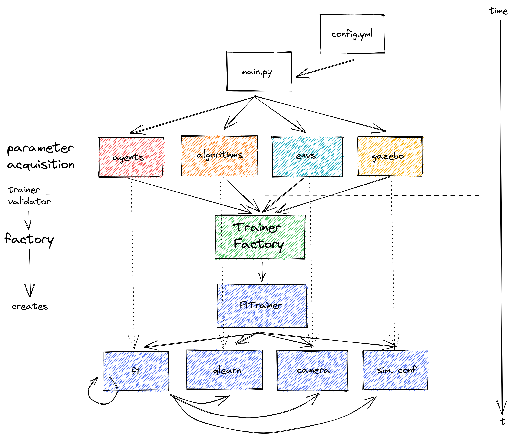

# Run RL Studio

## Usage

You can run a simple RLStudio trainer typing:

```bash
python main_rlstudio.py -n qlearn -a f1 -e simple -f config.yaml 
```

Or an inference making use of the script that uses a library created for that purpose

```bash
python main_rlstudio.py -n qlearn -a f1 -e simple -f config.yaml -m inference
```

> :warning: If you want to use inferencing in a program language other than python, you will 
> need extend the main_rlstudio.py to listen for inputs in a port and execute the loaded brain/algorithm to provide 
> outputs in the desired way. Note that inference_rlstudio.py is just the library used to inference


Open the `config.yaml` file and set the params you need.

## Project diagram




