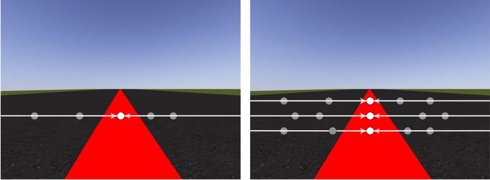
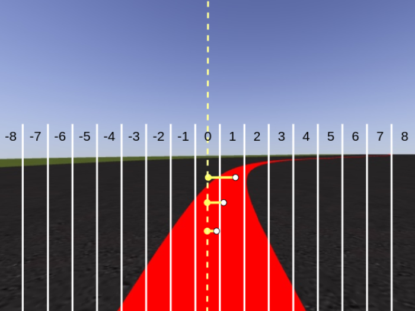
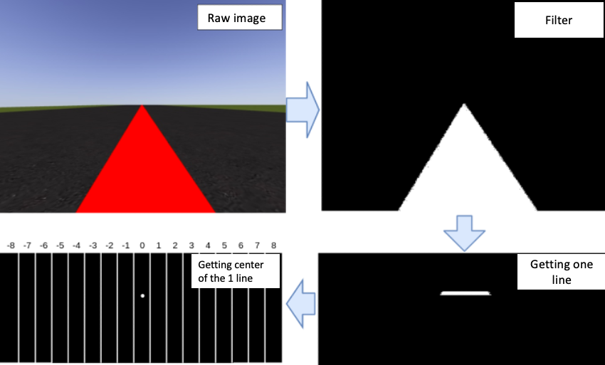
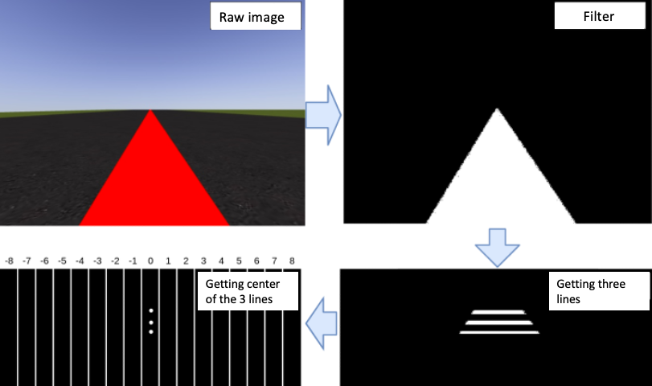
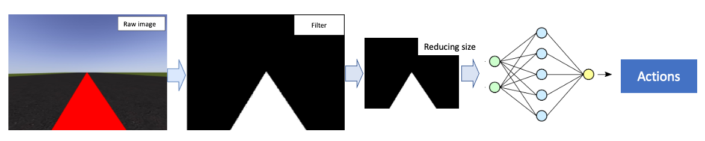
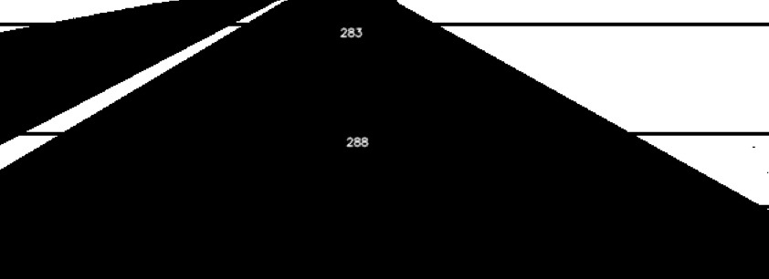

# Follow Line task

- **Objective**: drive around the circuit following the central line marked in red, as close as possible to this center of the line.

- **State**: Two ways of obtaining the state in which the agent is at each moment have been implemented: simplified perception and raw image

**Simplified perception**: the data collected by the camera sensor is processed to extract simplified perception points that reduce the pixels of the image so that the RL algorithm processes faster.
The points are taken in 1 or several rows of the input image, from the middle down, which is where the road information is located. The perception points can be 1, 2...n points, where $n < height\ of \ image / 2$. Next image shows examples with one and three points.

In addition, the image is divided vertically into 17 zones. In the area where the horizontal point falls, it is the state that feeds the algorithm. Next image shows three points of perception resulting in the $state = [1,1,0]$

In the following image you can see the extraction process of 1 simplified perception point

and 3 points

**Raw image**: camera sensor data received is preprocessed to convert it to black and white, to then reduce the appropriate size to be able to feed the neural network, generally a 32 x 32 size matrix. The neural network provides the output converted into actions such as linear and angular speed. In the image we can see the process implemented

- Reward: several reward functions have been defined, being a subject in constant development.

**Reward in function of the center of the line**: The robot gets the most reward by being positioned in the center of the center line. As the error with respect to the center of the line increases, the rewards decrease, 2 and 1, respectively. In case of leaving the road, there is a strong penalty of -100 to avoid misbehavior.

$$
reward =
  \begin{cases}
    10       & \quad \text{distancetocenter } <= | 0.2 | \\
    2        & \quad |0.4| >= \text{distancetocenter } > |0.2|  \\
    1        & \quad |0.9| >= \text{distancetocenter } > |0.4|  \\
    -100     & \text{distancetocenter } > |0.9|  \\
  \end{cases}
$$

**Reward in function of linear velocity, angular velocity and distance of the center line**.

We can assume that linear velocity and angular velocity are linearly related: when one increases, the other decreases. On long straight lines, the linear velocity **v** will be high and the angular velocity **w** must be 0, while on curves, as w increases,v decreases. The formula that governs this assumption is given by:

$$w_{target} = \beta_0 - \beta_1v$$

Assuming that the smallest radius in meters of a curve in our circuits is 5 meters, then we move in ranges of $v=[2, 30]$ and $w=[-6, 6]$

So, we can easily compute the error between actual and desirable angular velocity
$$error = w_{target} - w_{goal}$$

and the distance to center, so the reward function comes from:

$$reward = \frac{1}{\textit{e}^{(error + distancetocenter)}} $$

# Follow Lane task

- **Objective**: drive around the circuit following the right lane, whithout overlapping opposite lane or wayside.

- **State**: two ways of following the lane have been implemented:

**Following the center of the lane**: The image is pre-processed to convert it black and white, and the center of the right lane is obtained. In the image you can see the center of the lane for two random points of the image.

**Following the line center and apply an offset to the right**: the process is similar to the Follow Line task, where it obtains the center of the line. Now in the reward funciton, it applies an adequate offset to encourage following the right (or left) lane.

- **Reward**: several reward functions have been defined, being a subject in constant development.

- **In function of the center line**. The robot gets the most reward by being positioned in the center of the right lane. As the error with respect to the center of the line increases, the rewards decrease, 2 and 1, respectively. In case of leaving the road, there is a strong penalty of -100 to avoid misbehavior.

$$
reward =
  \begin{cases}
    10       & \quad 0.65 >= \text{distancetocenter } > 0.25 \\
    2        & \quad 0.9 > \text{distancetocenter } > 0.65  \\
    2        & \quad 0.25 >= \text{distancetocenter } > 0  \\
    1        & \quad 0 >= \text{distancetocenter } > -0.9  \\
    -100     & \text{distancetocenter } > |0.9|  \\
  \end{cases}
$$

- **In function of the center line, linear velocity and time to complete**. The idea is to force the agent going fast and try to finish the task as soon as posible. So, we rewarded fast velocities in center of lane positions, and penalize long steps. It has been added scalars, 10, 2 and 1, to encourage driving near the center.

$$
reward =
  \begin{cases}
    10 + velocity - ln(step)      & \quad 0.65 >= \text{distancetocenter } > 0.25 \\
    2 + velocity - ln(step)      & \quad 0.9 > \text{distancetocenter } > 0.65  \\
    2 + velocity - ln(step)        & \quad 0.25 >= \text{distancetocenter } > 0  \\
    1 + velocity - ln(step)        & \quad 0 >= \text{distancetocenter } > -0.9  \\
    -100     & \text{distancetocenter } > |0.9|  \\
  \end{cases}
$$
